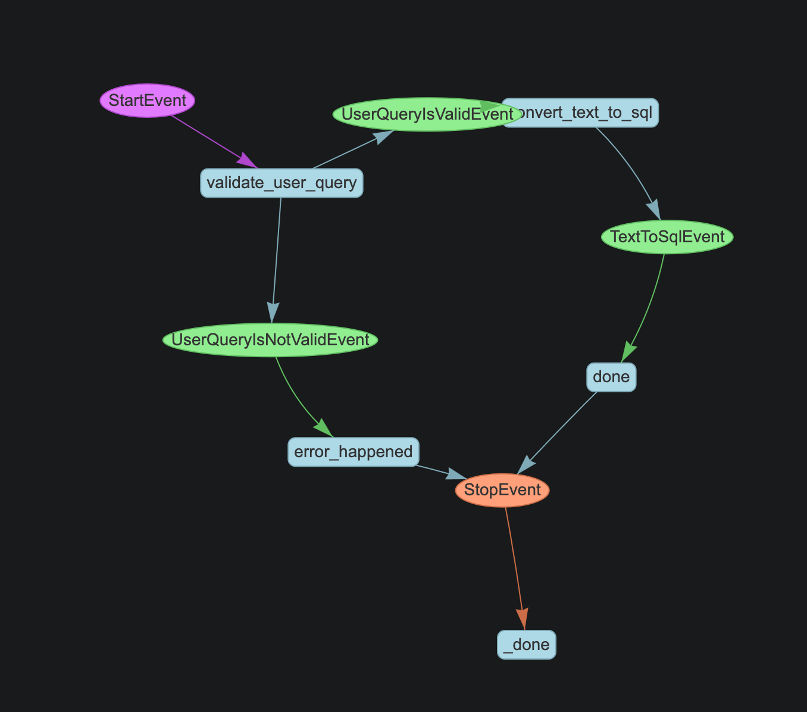

# SQL Whisper

## Summary

The project is split into two parts, a simple workflow that goes from text to `pd.DataFrame`
and a small problem set to study edge cases in the text to sql problem space.

> The only code and ideas that were generated with llm's are under `populate_db`.
> Everything else was written without gpt.

### SQL Whisper

This is a simple mock workflow to read from an PostgreSQL database with futures data via natural language.
It uses llamaindex under the hood.



### Problem set

The documentation for this can be found in the (problem)[./PROBLEM.md] readme.

## Missing features

- Error handling (e.g. try catch during sql execution)
- Linting/Formatting
- Comments

## Setup

### Poetry

Make sure to have poetry installed, and then install all dependencies and get the venv setup run

```bash
poetry install
```

Note that every python command needs to be run from the venv, the easiest way to do this is to run ```poetry shell```. Note that if you are using Neovim, this well then also help the lsp point to the right executable.

### PostgreSQL

Before running the example code the PostgreSQL server must be setup and populated.

Setup is done via docker, make sure to add the credentials in a .env file at the root of the directory.

```bash
docker run --name stock_db -p 5432:5432 -e POSTGRES_USER=your_user -e POSTGRES_PASSWORD=your_password -e POSTGRES_DB=stock_data -v pgdata:/var/lib/postgresql/data -d postgres:latest
```

Connect to the db to check if it's running.

```bash
psql -h localhost -p 5432 -U nacho -d stock_data
```

To populate the db run 

```bash
python populate_db/yfinance_loader.py
```

### Demo

Once you have everything setup you should be able to run the demo

`python demo.py`
